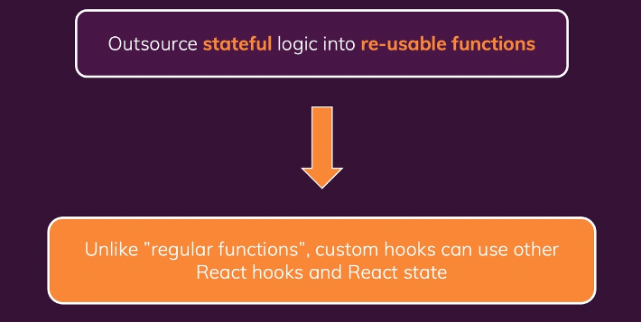

## Custom Hooks 이란?

Custom Hook은 useState와 같은 내장 hook처럼 정규 함수이다.  
Custom Hook을 통해 반복되는 로직을 쉽게 재사용할 수 있다. (로직 재사용)  

  

### Custom Hooks 사용 방법(?)
- custom hook의 이름은 무조건!!!! use로 시작해야한다.  
(해당 함수가 custom hook임을 리액트에게 알려줌)  
- Custom Hook이 만들어진 상태가 Custom Hook을 호출한 컴포넌트와 묶이게 된다.  
Custom Hook을 여러 컴포넌트에서 사용하게 되면 모든 컴포넌트가 각자의 상태를 받게 된다.  
Custom Hook을 사용함으로써 상태나 effect를 모든 컴포넌트가 공유하는 것이 아닌 각자의 상태를 받게 된다.  
즉, 로직만 공유하는 것이지 상태를 공유하는게 아니다.

---
