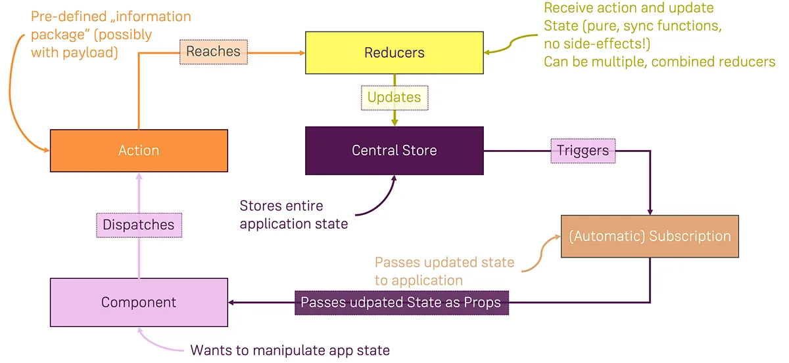

# Redux

A state management system for cross-component or app-wide state

---

## state type

- Local State
- Cross-Component State
- App-Wide State

 

| state                     | explain                                                           | managed                                                                  | e.g.                                                                                 |
| ------------------------- | ----------------------------------------------------------------- | ------------------------------------------------------------------------ | ------------------------------------------------------------------------------------ |
| **Local State**           | State that belongs to a **single component**                      | Should be managed componenet-internal   with useState()/useReducer() | listening to user input in a input field;   toggling a "show more" details field |
| **Cross-Component State** | State that **affects multiple components**                        | Requires "prop chains"/"prop drilling"   React Context   Redux   | open/closed state of a modal overlay                                                 |
| **App-Wide State**        | State that **affects the entire app**   (most/all components) | Requires "prop chains"/"prop drilling"   React Context   Redux   | user authentication status                                                           |

---

## Redux vs React Context (redux를 왜 사용해야 하는가?)

React Context (potential) 단점

- **Complex Setup/Management**  
  In more complex apps, managing React Context can lead to deeply nested JSX code and / or huge "Context Provider" components.
  app 규모가 커질 수록 state를 관리하기 위해 많은 다른 종류의 context provider 생기게 되고, 중첩된 JSX코드가 나타날 수 있다.
- **Low Performance**  
  React Context is not optimized for high-frequency state changes.

---

## Redux 작동방식

  

1. Store(스토어)  
   Central Data(State) Store, 하나의 프로젝트는 하나의 스토어만 가질 수 있다.  
   절대 직접 스토어 내 데이터를 수정해서는 안된다. (Reducer를 통해서만 수정 가능 : Dispatch -> Action -> ReducerFn)
2. Subscribe(구독)  
   스토어의 내장 함수 중 하나인 구독은 리스너 함수를 파라미터로 넣어 호출하면 상태가 업데이트될 때마다 호출된다. 일종의 이벤트 리스너라고 볼 수 있다.
3. Dispatch(디스패치)  
   스토어의 내장 함수 중 하나인 디스패치는 액션 객체를 넘겨줘서 **상태를 업데이트 하는 유일한 방법**이다. 이벤트 트리거라고 생각할 수 있다.
4. Action(액션)  
   상태에 변화가 필요하다면 액션을 일으켜야한다. 액션은 객체로 표현되며 type필드를 반드시 가지고 있어야 한다.
5. Action Creator(액션 생성함수)  
   액션 생성함수는 액션 객체를 만들어주는 함수이다. 화살표 함수로도 표현이 가능하다.
6. Reducer Function(리듀서)  
    store에서 관리하는 데이터(상태)를 결정한다. action이 도착할 때 마다 새 상태 snapshot을 내보낸다.
   리듀서는 현재 상태와 액션 객체를 받아, 필요하다면 새로운 상태를 리턴하는 함수이다. 액션 유형을 기반으로 이벤트를 처리하는 이벤트 리스너라고 생각하면 된다.  
    [**절대 기존의 state를 변형해서는 안된다.**](https://academind.com/tutorials/reference-vs-primitive-values)

   - 예측 불가능한 버그가 발생할 수 도 있음.
   - 프로그램 디버깅이 어려울 수 있음.
   - state가 동기화되지 않는 더 큰 APP에서 예기치 않은 부작용이 생길 수 있음.
   - 갑자기 UI가 state를 정확히 반영하지 않을 수 있음.

   순수 함수여야 한다.

   - 같은 입력값은 같은 출력값을 리턴한다.  
     side-effect(e.g. http 요청, 로컬저장소에 뭔가 쓰거나/패치)가 없어야 한다.
   - Inputs: Old State + Dispatched Action
   - Output: New State Object

---

참고 사이트

- [Redux 정리](https://kyun2da.dev/%EB%9D%BC%EC%9D%B4%EB%B8%8C%EB%9F%AC%EB%A6%AC/Redux-%EC%A0%95%EB%A6%AC/#%EB%A6%AC%EB%8D%95%EC%8A%A4-%EC%83%81%ED%83%9C-%EB%B3%80%ED%99%94%EC%9D%98-%ED%9D%90%EB%A6%84)
- [Redux vs React's Context API](https://academind.com/tutorials/reactjs-redux-vs-context-api)
